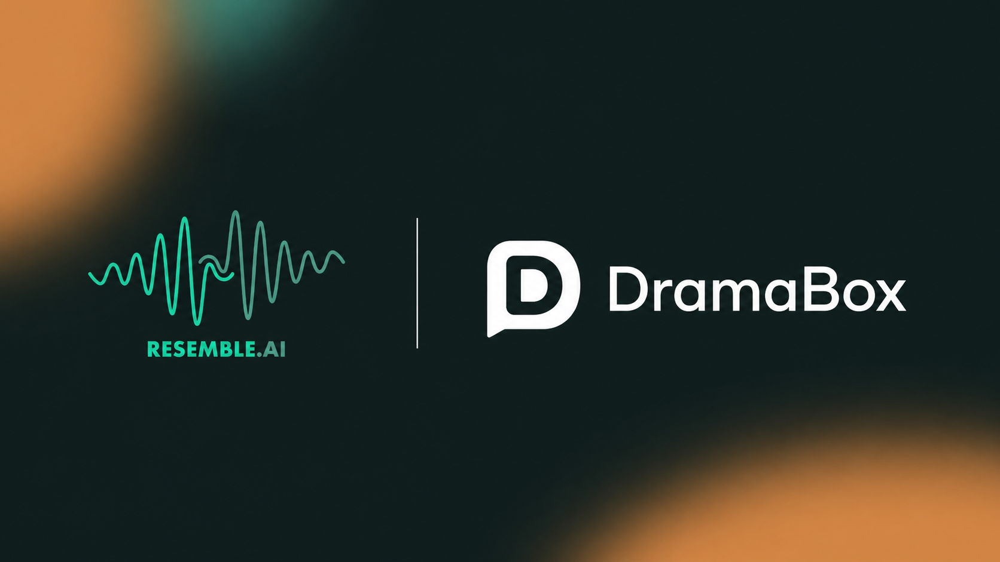

<p align="center">
  
</p>

# DramaBox Studio — AI Voice Studio (Community Edition)

[](LICENSE)
[](https://github.com/Lightricks/LTX-2)
[](https://github.com/resemble-ai/DramaBox)

A community distribution of **Resemble AI's DramaBox** — expressive, prompt-driven TTS with voice cloning. The prompt controls speaker identity, emotion, delivery, laughs, sighs, pauses and transitions; a 10-second voice reference clones the target timbre.

**Built for Chinese users. Optimized for low-VRAM GPUs. Batteries included.**

---

## What's Different from Upstream

| Feature | Upstream | DramaBox Studio |
|---|---|---|
| VRAM peak | ~24 GB | **~8 GB** (8 GB cards supported) |
| VRAM config | Manual | **Auto-detect** (3 tiers) |
| UI | Default Gradio | **Midnight Gold** dark cinematic theme |
| Voice library | None | **Upload / name / list / delete** |
| Dialogue workshop | None | **Script → auto-parse characters → batch generate** |
| Prompt examples | 2 English | **8 Chinese-scene examples** with English direction |
| Prompt helpers | None | **One-click speaker tags + 18 non-verbal cues + quote wrapper** |
| Language | English prompts | English direction + Chinese dialogue supported |

---

## Demo

<video src="https://github.com/user-attachments/assets/29385327-8af3-4ef0-a8d5-3c57a8225409" controls width="100%"></video>

---

## Quick Start

### Prerequisites

- Windows 10 / 11
- NVIDIA GPU with **8 GB+ VRAM**
- NVIDIA driver installed

### Option 1: Integration Package (Recommended)

Download the all-in-one package (embedded Python + models included):

> [Download — 一键包下载.vip](https://wangzhifeng.vip/)
> 
> Win系统一键启动整合包，解压即用。含嵌入式 Python 环境 + 全部模型权重。

Unzip, double-click `DramaBoxStudio.bat`, open `http://localhost:7860`.

### Option 2: Run from Source

**Requirements**

- Python 3.10 – 3.13
- Git
- ~25 GB free disk space (for model weights)
- Internet connection (first run only — downloads model weights)

**Step 1: Clone**

```bash
git clone https://github.com/wwzhifeng/DramaBoxStudio.git
cd DramaBoxStudio
```

**Step 2: Install PyTorch with CUDA**

```bash
pip install torch==2.8.0 torchaudio==2.8.0 --index-url https://download.pytorch.org/whl/cu128
```

Pick the CUDA version matching your driver. Check with `nvidia-smi` (top-right corner).

| NVIDIA driver | CUDA version | pip index |
|---|---|---|
| >= 572.00 | CUDA 12.8 | `cu128` |
| >= 550.00 | CUDA 12.4 | `cu124` |
| >= 545.00 | CUDA 12.1 | `cu121` |

**Step 3: Install remaining dependencies**

```bash
pip install -r requirements.txt
```

**Step 4: Launch**

```bash
python app.py
```

Open `http://localhost:7860` in your browser.

### Model Download

Models are **auto-downloaded** on first launch from HuggingFace — no manual setup required.

| Model | Source | Size |
|---|---|---|
| DiT Transformer | [ResembleAI/Dramabox](https://huggingface.co/ResembleAI/Dramabox) | 6.6 GB |
| Audio Components (VAE + Vocoder) | [ResembleAI/Dramabox](https://huggingface.co/ResembleAI/Dramabox) | 1.9 GB |
| Text Encoder (Gemma 3 12B, 4-bit) | [unsloth/gemma-3-12b-it-bnb-4bit](https://huggingface.co/unsloth/gemma-3-12b-it-bnb-4bit) | ~8 GB |

**Total: ~16 GB. First launch may take 10–30 minutes. Subsequent launches load in ~10 seconds.**

> If HuggingFace is slow in your region, set a mirror before launching:
> ```bash
> set HF_ENDPOINT=https://hf-mirror.com
> python app.py
> ```

---

## Prompt Writing

```
<speaker description in English>, "<dialogue>" <action direction> "<more dialogue>"
```

**Inside quotes** — spoken aloud:
- Dialogue: `"Hello, how are you?"`
- Vocal sounds (one word): `"Hahaha"` `"Hehehe"` `"Mmmmm"` `"Ugh"`

**Outside quotes** — performed, not spoken:
- `She sighs deeply.` · `A long pause.` · `He clears his throat.`
- `Her voice cracks.` · `He gulps nervously.` · `She drops to a whisper.`

**Never put inside quotes:** `Sigh` `Gasp` `Cough` `Ahem` `Pfft` — the model will speak them literally.

**Tips:**
- Match speaker description gender/age to the voice reference
- Break long dialogue with stage directions between segments
- Use the built-in cue dropdown (18 non-verbal actions) to insert at cursor
- Select Chinese text and click `「」→""` to wrap it in quotes

---

## Inference Settings

| Parameter | Default | Effect |
|---|---|---|
| `cfg_scale` | 2.5 | Lower = more natural, higher = more text-faithful |
| `stg_scale` | 1.5 | Skip-token guidance for expressiveness |
| `duration_multiplier` | 1.1 | 10% breathing room on auto-estimated length |
| `steps` | 30 | Euler flow matching |
| Speed | 0.5–2.0x | Tempo change without pitch shift |

---

## Roadmap

- [ ] Structured prompt builder (visual fill-in-the-blank UI)
- [ ] Streaming audio playback
- [ ] Batch export with subtitle (.srt) generation
- [ ] More Chinese reference voices
- [ ] Chinese LoRA fine-tune for native-level Mandarin prosody

---

## Contributing

Contributions are welcome! This is a community project — if you have ideas, bug fixes, or want to add features:

- **Bug report / Feature request:** [Open an Issue](../../issues)
- **Code contribution:** Fork the repo, create a branch, [open a Pull Request](../../pulls)
- **Share your prompts:** Found a great prompt recipe? Share it in Discussions
- **Chinese voices:** Have a clean 10s+ Chinese voice sample? Contributions to the voice library are especially welcome

If you're not sure where to start, check the [Roadmap](#roadmap) above or look for issues tagged `good first issue`.

---

## License

This project is a derivative of [ResembleAI/DramaBox](https://github.com/resemble-ai/DramaBox), which is an IC-LoRA fine-tune of [Lightricks/LTX-2.3](https://github.com/Lightricks/LTX-2). Distributed under the **LTX-2 Community License Agreement** — see [LICENSE](LICENSE).

**Attribution:**
- Original DramaBox by [Resemble AI](https://www.resemble.ai/learn/models/dramabox)
- Base model LTX-2.3 by [Lightricks](https://github.com/Lightricks/LTX-2)
- Community modifications by **Wang Zhifeng** ([wangzhifeng.vip](https://wangzhifeng.vip/))

Model weights are auto-downloaded from [ResembleAI/Dramabox](https://huggingface.co/ResembleAI/Dramabox) on HuggingFace and are **not** included in this repository.

---

## Disclaimer

This is an unofficial community distribution. For the official DramaBox, visit [ResembleAI/DramaBox](https://github.com/resemble-ai/DramaBox).

DramaBox outputs are automatically watermarked with [Resemble Perth](https://github.com/resemble-ai/Perth) when the watermark feature is enabled. Please comply with the [LTX-2 Acceptable Use Policy](LICENSE) when using generated audio.
